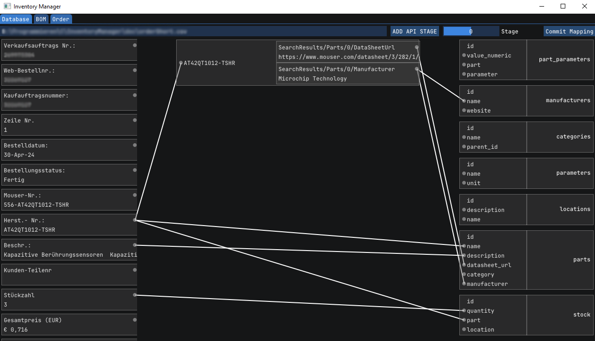
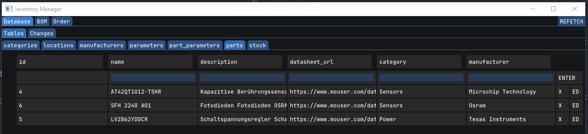

# Inventory Manager
An inventory manager with UI that is based on a local postgresql database. 

## Current Stage
CSV-files can now be used to generate changes which then can be executed and sent to the local database.
A generic api can be used to fetch additional data. Data can be filtered with a simple keyword.

## Dependencies
- libcurl
- libpqxx
- imgui
- C++23
- dx11

```c++
class App {
   private:
    ImGuiDX11Context imguiCtx;

```
The only interface to the dx11-backed is through these three functions:
```c++
while (running) {
    if (!imguiCtx.pollEvents()) { // POLL EVENTS
        /*
        ...
        */
    }

    if (!imguiCtx.beginFrame()) { continue; } // BEGIN FRAME
    /*
    ...
    */
    imguiCtx.endFrame(); // END FRAME
}
```

## Visual Examples
Mapping view: 


Database view:


